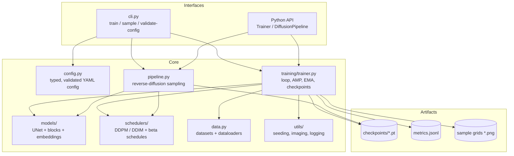
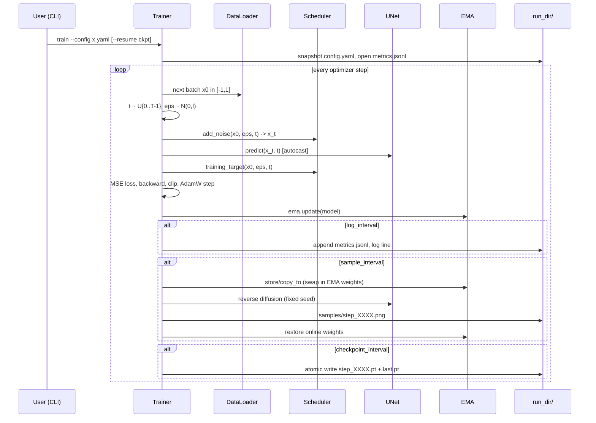
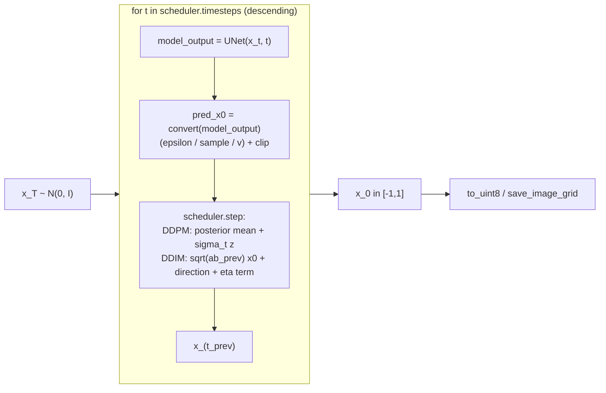
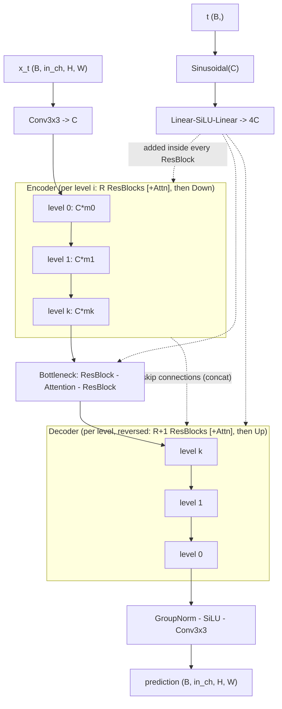
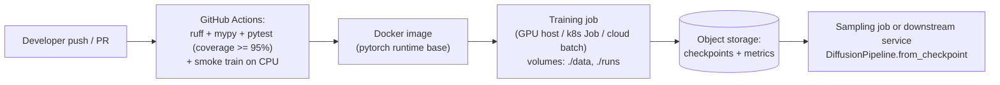

# Architecture

This document describes the system design of `diffusionlab`, from the
high-level component layout down to the UNet internals, together with the
rationale behind every significant decision.

## 1. High-level architecture

`diffusionlab` is a **library + CLI**, not a network service. The deployable
artifacts are (a) the Python package, (b) trained checkpoints, and (c) a
container image that runs training or sampling jobs. There is deliberately no
REST API, database, or long-running server: a diffusion trainer is a batch
workload, and generated images are files. (If you need a generation service,
wrap `DiffusionPipeline` in your serving framework of choice; the pipeline is
stateless after construction and safe to share across request threads for
inference under `torch.no_grad`.)

**Dependency rule:** arrows point downward only. `models/` and `schedulers/`
know nothing about training or I/O; `config.py` knows nothing about torch
modules; only `trainer.py` and `pipeline.py` compose the pieces. This keeps
the mathematical core independently testable and reusable.

## 2. Training sequence

## 3. Sampling data flow

## 4. UNet architecture (low level)

For `base_channels=C`, `channel_multipliers=(m0..mk)`, `num_res_blocks=R`:

Key block-level choices (see `models/blocks.py` docstrings for details):

| Choice | Rationale |
| --- | --- |
| GroupNorm (+SiLU) everywhere | Batch-size independent (small per-GPU batches are common); DDPM standard |
| Zero-initialised residual branches | Every block starts as identity: deep UNets begin training as a well-conditioned near-identity map |
| Additive timestep conditioning between the two convs | The classic DDPM recipe; simple and sufficient at this scale |
| `F.scaled_dot_product_attention` | Dispatches to flash/memory-efficient kernels automatically |
| Resize-then-conv upsampling | Avoids transposed-convolution checkerboard artefacts |
| Skip channel bookkeeping mirrored at build time | The decoder consumes exactly the encoder's pushed feature maps; an assert guards the invariant |

## 5. Scheduler design

`BaseScheduler` owns everything both samplers share: the beta schedule and
its derived quantities (computed in **float64**, stored as float32 -- the
cumulative alpha products visibly lose precision in float32 at T=1000), the
closed-form forward process `add_noise`, the prediction-type conversions,
and the training-target selection. Subclasses add only the reverse rule:

- **DDPMScheduler** precomputes the posterior coefficients and performs
  ancestral (stochastic) steps over the *full* chain. It refuses step
  subsampling because the posterior is only defined between adjacent
  timesteps.
- **DDIMScheduler** selects a timestep subsequence (`leading` or `trailing`
  spacing) and applies the non-Markovian DDIM update, interpolating between
  fully deterministic (`eta=0`) and DDPM-matching stochasticity (`eta=1` --
  an identity verified by the test suite).

Both expose the same protocol (`set_timesteps` / `timesteps` / `step`), so
`DiffusionPipeline` is sampler-agnostic, and `build_scheduler` gives a
registry-based factory (open for extension: an Euler or DPM-Solver sampler
would subclass `BaseScheduler` and register itself without touching callers).

Schedule tensors live on CPU; `_extract` moves the per-step scalar slices to
the data device on demand. At T=1000 these are 4 KB tensors -- the transfer
is noise compared to a UNet forward, and it keeps schedulers device-free
(the same object serves CPU tests and GPU training).

## 6. Configuration architecture

A single `Config` dataclass tree (`model` / `diffusion` / `data` / `optim` /
`training`) is the **only** source of hyperparameters. Properties:

- **Strict loading**: unknown YAML keys raise with the section and the list
  of valid keys -- a typo cannot silently fall back to a default.
- **Cross-field validation** in one place (`Config.validate`): channel/group
  divisibility, image size vs UNet depth, dataset channels vs model
  channels, DDPM's full-chain requirement, attention-head divisibility.
- **Round-trippable**: `to_dict()` emits only YAML/JSON primitives. The
  trainer snapshots the config into each run directory and embeds it in
  every checkpoint, so a checkpoint is self-describing.
- **Dotted overrides** (`--set a.b=v`) are YAML-parsed, giving typed lists
  and booleans from the command line.

## 7. Reliability and fault tolerance

| Failure | Mitigation |
| --- | --- |
| Crash mid-checkpoint-write | Write to `*.tmp`, `os.replace` (atomic on POSIX), then copy to `last.pt` |
| Process killed mid-run | Resume from `last.pt` restores model, EMA, optimizer, scaler, step, and RNG states |
| NaN/Inf loss (LR too high, fp16 overflow) | Fail-fast `RuntimeError` at the offending step with remediation hints, instead of silently training a dead model |
| Corrupt/malicious checkpoint | `weights_only=True` loading + required-key validation |
| Metrics loss on crash | JSONL is appended and flushed per record; at most one in-flight record is lost |
| Config drift between resume and original run | Checkpoint embeds its config; a mismatch on resume logs an explicit warning |

**Disaster recovery** is file-based by design: a run is fully reconstructible
from `config.yaml` + any checkpoint. Back up the `checkpoints/` directory of
long runs to object storage on the `checkpoint_interval` cadence (see
`docs/operations.md`).

## 8. Performance considerations

- **Mixed precision**: `fp16` (with dynamic loss scaling) or `bf16` via
  `training.mixed_precision`; the MSE loss is always computed in float32.
- **Gradient accumulation** decouples effective batch size from GPU memory.
- **DataLoader**: pinned memory on CUDA, persistent workers, seeded shuffle,
  `drop_last` for constant batch statistics.
- **EMA via `lerp_`**: in-place, no allocation per step.
- **Sampling cost** is `num_inference_steps x` one UNet forward per batch;
  DDIM at 50 steps is ~20x cheaper than full DDPM at T=1000.
- **Scaling up**: the single-process trainer is intentionally simple; for
  multi-GPU, wrap `Trainer.model` in DDP and shard the dataloader -- the
  design isolates that change to `trainer.py` (documented as the intended
  extension point, not implemented speculatively).

## 9. Deployment architecture

The container is workload-agnostic: the same image runs `diffusionlab train`
or `diffusionlab sample` depending on the command, with `data/` and `runs/`
mounted as volumes (twelve-factor: config via files/flags, state via mounts,
logs to stdout).

## 10. Technology selection

| Decision | Alternatives considered | Why this choice |
| --- | --- | --- |
| PyTorch | JAX, TensorFlow | Ecosystem standard for diffusion research; `scaled_dot_product_attention`, AMP, and `weights_only` loading cover our needs natively |
| Plain dataclasses + PyYAML for config | pydantic, hydra, OmegaConf | Zero heavy deps; strictness and validation are ~150 lines we fully control; hydra's power is unneeded for one config tree |
| argparse CLI | click, typer | Stdlib, testable via `main(argv)`, no dependency |
| JSONL metrics | TensorBoard, wandb | Dependency-free, machine-readable, trivially forwarded; a wandb/TensorBoard sink can be added in `utils/logging.py` without touching the trainer |
| Step-based (not epoch-based) loop | epochs | Diffusion budgets are quoted in steps; dataset-size independent |
| setuptools + pyproject | poetry, hatch | Boring, universal, sufficient |
